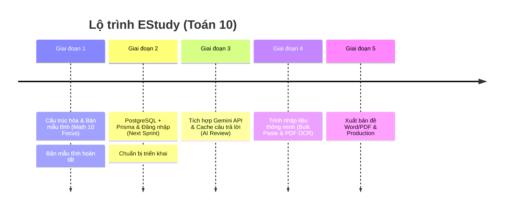

# Lộ trình Phát triển (Product Roadmap): EStudy

Tài liệu này vạch ra các giai đoạn phát triển chính để hoàn thiện nền tảng **EStudy**.

---

## 📈 Lộ trình triển khai (Math Grade 10 Start)

---

## 🏁 Giai đoạn 1: Bản mẫu Giao diện EStudy Toán 10 (Giai đoạn hiện tại)
* **Mục tiêu:** Mô phỏng 100% luồng nghiệp vụ giao bài, làm bài trực tuyến và rà soát lỗi sai của học sinh tập trung cho **Toán lớp 10 chương trình GDPT 2018**.
* **Các trang đã hoàn thành:**
  * **Giáo viên:** Bảng điều khiển, Trình tạo bài tập theo cấu trúc ma trận phân bổ, Bảng phân tích câu sai theo chương (Hàm số bậc hai, Vectơ...), Ngân hàng câu hỏi Toán 10, Trợ lý AI, Trình thêm câu hỏi thủ công, Trình nhập nhanh Bulk Paste.
  * **Học sinh:** Bảng bài tập cần làm, Giao diện trắc nghiệm/điền từ ngắn có đếm thời gian, Báo cáo kết quả chi tiết kèm lời giải AI và kho ôn tập câu sai cá nhân.

---

## 🚀 Giai đoạn 2: Tích hợp Database & Đăng nhập (Next Sprint)
* **Mục tiêu:** Thay thế mock-data bằng cơ sở dữ liệu thực.
* **Các nhiệm vụ chính:**
  1. Cấu hình **Prisma ORM** và kết nối tới database **PostgreSQL**.
  2. Thiết kế lược đồ (Schema) cho lớp học, bài tập, câu hỏi Toán 10 và các lượt nộp bài.
  3. Cài đặt **Auth.js (NextAuth v5)** phân quyền Giáo viên và Học sinh.
  4. Triển khai API lưu trữ kết quả và chấm điểm tự động.

---

## 🧠 Giai đoạn 3: Tích hợp Gemini API & Cache
* **Mục tiêu:** Hoàn thiện giải thích câu sai và sinh câu hỏi tương tự động bằng AI.
* **Các nhiệm vụ chính:**
  1. Kết nối **Google Gemini API** tự động sinh lời giải chi tiết.
  2. Tạo thuật toán tự sinh câu hỏi tương đương Toán 10 dựa trên câu làm sai.
  3. Xây dựng dịch vụ **Cache** kết quả trả về của AI để tối ưu hóa tốc độ và giảm 95% chi phí API.

---

## 📄 Giai đoạn 4: Trình nhập đề thông minh & Xuất bản (OCR & Export)
* **Mục tiêu:** Tự động hóa bóc tách tệp PDF/Word đề thi Toán 10 của giáo viên.
* **Các nhiệm vụ chính:**
  1. Tích hợp Vision API / Document AI để đọc ảnh chụp đề thi và file PDF.
  2. Bóc tách câu hỏi trắc nghiệm, nhận diện công thức toán học (LaTeX) và khớp đáp án tự động từ file giải.
  3. Giao diện kiểm duyệt câu hỏi cho giáo viên trước khi lưu.
  4. Hỗ trợ xuất đề bài và đáp án ra file **Word (.docx)** và **PDF**.
