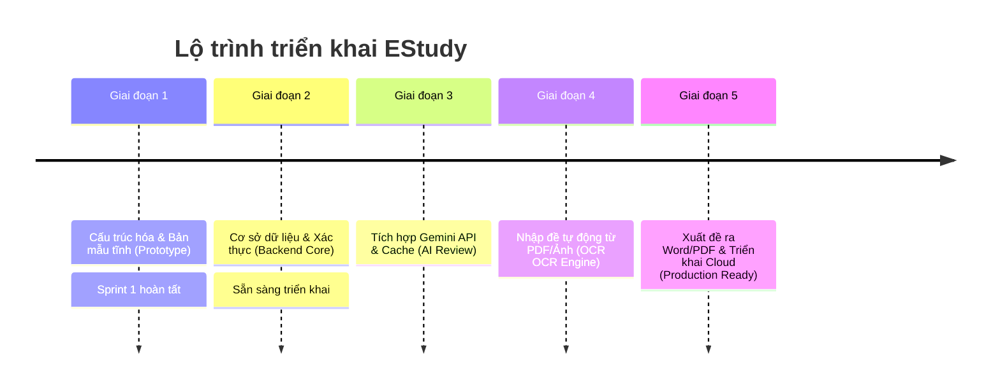

# Lộ trình Phát triển (Product Roadmap): EStudy

Tài liệu này vạch ra các giai đoạn phát triển chính để hoàn thiện nền tảng giao bài tập và phân tích câu hỏi làm sai **EStudy**.

---

## 📈 Tóm tắt các Giai đoạn (Phases Summary)

---

## 🏁 Giai đoạn 1: Bản mẫu Giao diện EStudy (Giai đoạn hiện tại)
* **Mục tiêu:** Tạo bản mẫu giao diện độ trung thực cao (high-fidelity mock-up) chạy local mô phỏng 100% luồng nghiệp vụ giao bài, làm bài trực tuyến và rà soát lỗi sai của học sinh.
* **Các trang đã hoàn thành:**
  * **Giáo viên:** Bảng điều khiển quản lý lớp, Trình tạo bài tập nhanh, Bảng phân tích câu sai nâng cao (Sai nhiều nhất, Bỏ qua, Tốn thời gian), Ngân hàng câu hỏi, Trợ lý AI Ôn tập, và Nhập đề thi mockup.
  * **Học sinh:** Bảng điều khiển bài tập cần làm, Giao diện trắc nghiệm trực tuyến có đếm thời gian, Báo cáo kết quả bài làm chi tiết (đáp án đúng/sai, thời gian làm từng câu) và kho ôn tập câu sai cá nhân.

---

## 🚀 Giai đoạn 2: Tích hợp Hệ thống lưu trữ & Đăng nhập (Next Sprint)
* **Mục tiêu:** Xây dựng lõi ứng dụng động (Dynamic application), thay thế toàn bộ mock-data bằng cơ sở dữ liệu thực.
* **Các nhiệm vụ chính:**
  1. Cấu hình **Prisma ORM** và kết nối tới cơ sở dữ liệu **PostgreSQL**.
  2. Thiết kế lược đồ (Schema) chuẩn cho các thực thể: `User` (Role-based), `Class`, `Assignment`, `Question`, `Attempt`, `Answer`.
  3. Cài đặt **Auth.js (NextAuth v5)** để phân quyền đăng nhập giữa Giáo viên và Học sinh.
  4. Viết các API Route để lưu trữ kết quả và chấm điểm tự động.

---

## 🧠 Giai đoạn 3: Tích hợp Trí tuệ nhân tạo (AI Engine & Cache)
* **Mục tiêu:** Đưa các tính năng cốt lõi dựa trên AI vào hoạt động thực tế.
* **Các nhiệm vụ chính:**
  1. Kết nối với **Google Gemini API** để tự sinh lời giải chi tiết theo ngữ cảnh câu hỏi.
  2. Tạo thuật toán tự sinh câu hỏi tương tự cùng chương học & độ khó từ câu học sinh làm sai.
  3. Xây dựng dịch vụ **Cache** kết quả trả về của AI để tránh lặp lại các cuộc gọi trùng lặp, giúp tiết kiệm 95% chi phí API.

---

## 📄 Giai đoạn 4: Nhập đề thông minh & Xuất bản (OCR & Export)
* **Mục tiêu:** Tiết kiệm tối đa thời gian nhập đề bài của giáo viên.
* **Các nhiệm vụ chính:**
  1. Tích hợp Google Vision API / Document AI hoặc Gemini để đọc ảnh chụp đề thi và file PDF.
  2. Xây dựng thuật toán bóc tách câu hỏi trắc nghiệm, nhận diện công thức toán học và khớp đáp án tự động từ file giải.
  3. Cung cấp giao diện kiểm duyệt (Review) cho giáo viên trước khi đưa vào ngân hàng đề.
  4. Hỗ trợ xuất đề bài và đáp án ra file **Word (.docx)** và **PDF** chất lượng cao.
