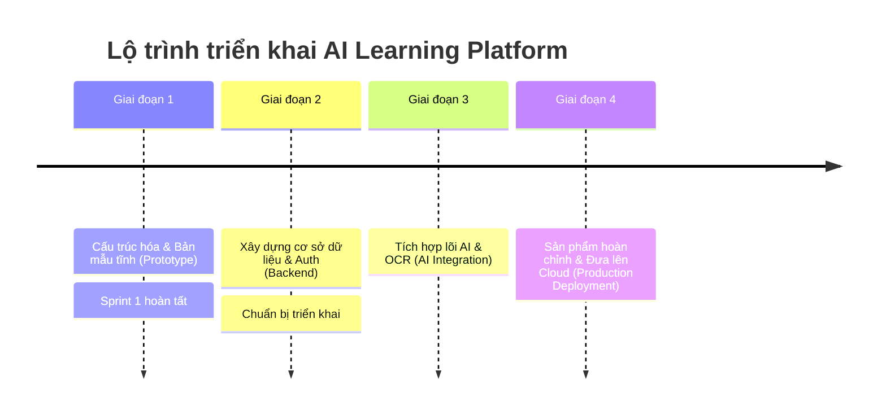

# Lộ trình Phát triển (Product Roadmap): AI Learning Platform

Tài liệu này vạch ra các giai đoạn phát triển chính để hoàn thiện nền tảng học tập thông minh.

---

## 📈 Tóm tắt các Giai đoạn (Phases Summary)

---

## 🏁 Giai đoạn 1: Bản mẫu Giao diện tương tác (Sprint 1 - Đã hoàn thành)
* **Mục tiêu:** Tạo bản mẫu giao diện độ trung thực cao (high-fidelity mock-up) tĩnh chạy local phục vụ trải nghiệm người dùng trước khi viết mã backend.
* **Các trang đã hoàn thành:**
  * **Học sinh:** Bảng điều khiển tổng quan, Danh sách câu hỏi luyện tập, Chi tiết câu hỏi và bảng chọn đáp án, Giải thích bằng AI (mock), Gợi ý câu hỏi tương tự (mock), Trang phân tích kết quả học tập.
  * **Giáo viên:** Bảng điều khiển quản lý lớp, Danh sách lớp học và Mã mời học sinh, Danh sách bài tập tự tạo hoặc sinh bằng AI (mock), Trang thống kê tiến độ học tập các lớp.
  * **Admin:** Trang quản lý tổng quan hệ thống, Quản lý ngân hàng câu hỏi, Giao diện cấu hình tham số AI Prompt & Mô hình LLM.

---

## 🚀 Giai đoạn 2: Tích hợp Hệ thống lưu trữ & Đăng nhập (Next Sprint)
* **Mục tiêu:** Xây dựng lõi ứng dụng động (Dynamic application), thay thế toàn bộ mock-data bằng cơ sở dữ liệu thực.
* **Các nhiệm vụ chính:**
  1. Cấu hình **Prisma ORM** và kết nối tới **PostgreSQL**.
  2. Thiết kế lược đồ (Schema) cho `User`, `Class`, `Assignment`, `Question`, `Submission`.
  3. Cài đặt **Auth.js (NextAuth v5)** để phân quyền đăng nhập giữa Học sinh, Giáo viên và Quản trị viên.
  4. Viết các API Route để lưu trữ bài làm và điểm số thực tế của học sinh.

---

## 🧠 Giai đoạn 3: Tích hợp Trí tuệ nhân tạo (AI & Document OCR)
* **Mục tiêu:** Đưa các tính năng cốt lõi dựa trên AI vào hoạt động.
* **Các nhiệm vụ chính:**
  1. Kết nối với **Google Gemini API** (Gemini 1.5 Pro & Flash) để sinh lời giải tự động theo ngữ cảnh bài học THPT Việt Nam.
  2. Xây dựng dịch vụ **OCR và Parser PDF** để tự động trích xuất các bài tập toán học, vật lý, hóa học kèm công thức từ tệp giáo viên tải lên thành các thực thể dữ liệu có cấu trúc.
  3. Phát triển thuật toán gợi ý học tập (Recommendation Engine) dựa trên lịch sử làm bài để chỉ ra lỗ hổng kiến thức.

---

## ☁️ Giai đoạn 4: Đóng gói sản phẩm & Triển khai Cloud
* **Mục tiêu:** Tối ưu hóa hiệu năng, bảo mật và đưa ứng dụng lên máy chủ sản xuất.
* **Các nhiệm vụ chính:**
  1. Triển khai ứng dụng Next.js lên **Vercel** hoặc Dockerized Cloud Run trên **GCP**.
  2. Tối ưu hóa thời gian tải trang bằng Server-Side Rendering (SSR) kết hợp Incremental Static Regeneration (ISR).
  3. Cấu hình tường lửa chống tấn công DDOS và giới hạn tần suất gọi API (Rate Limiting).
